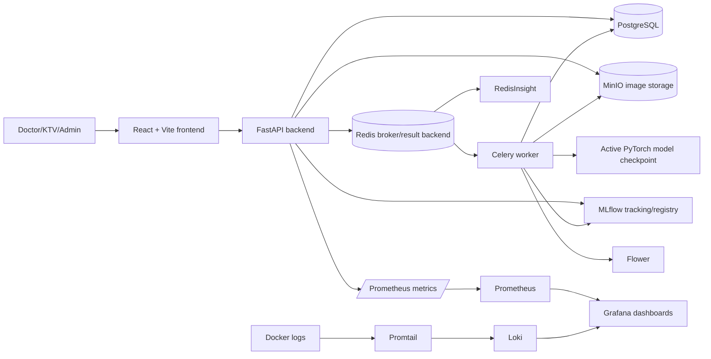
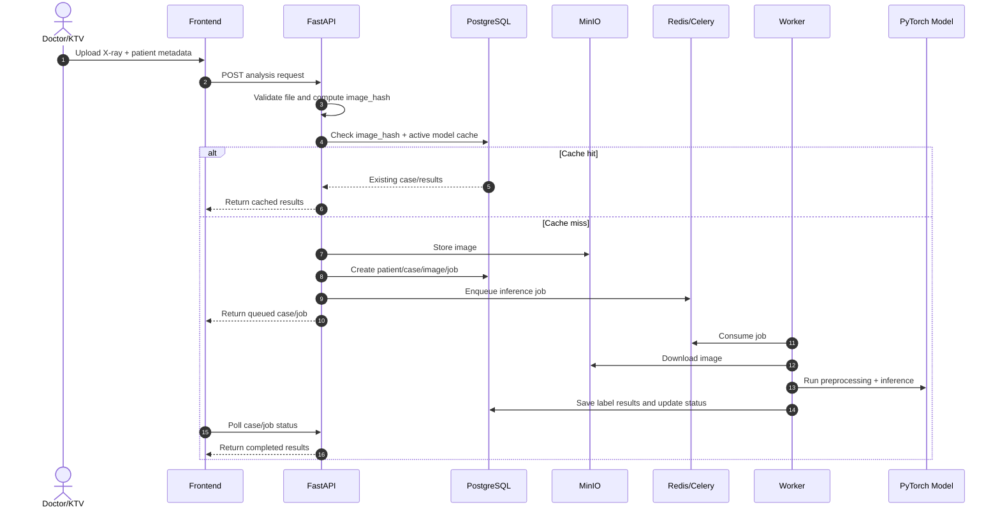

# Medical Imaging Stream Analysis for Anomaly Detection

Development-ready system for streaming chest X-ray analysis, asynchronous AI inference, review workflows, and lightweight MLOps operations.

> This repository is for development, testing, and demonstration. The model and workflow are not clinically certified and must not be used for real medical diagnosis without proper validation, governance, and regulatory approval.

## Overview

The application supports a hospital-style workflow:

1. Doctor/KTV users log in and upload a chest X-ray with patient metadata.
2. The backend validates the request, computes an image hash, checks the cache, stores the image, and creates an analysis job.
3. Celery workers process inference asynchronously using the active model.
4. Results are stored per label and shown in the web UI.
5. Doctor/Admin users confirm or correct AI results before data becomes retraining-ready.
6. Admin users manage users, models, reviews, retraining, and monitoring.

Core labels:

- `Atelectasis`
- `Effusion`
- `Infiltration`
- `No_Finding`

## Features

- Role-based login for Doctor/KTV and Admin users.
- Chest X-ray upload with patient metadata, preview, validation, and duplicate cache checks.
- Async inference pipeline with FastAPI, Celery, Redis, PostgreSQL, and MinIO.
- Local MobileNetV3-Small checkpoint support through PyTorch/TorchVision.
- One `AnalysisResult` row per model label.
- Case history, case detail, stored image retrieval, and browser-printable reports.
- Review workflow for uncertain cases and manual confirmation/correction for completed cases.
- Retraining manifest export from confirmed/corrected labels only.
- Admin model registry APIs and MLflow tracking/registry integration.
- Candidate model registration, promotion gates, and active model management.
- Observability stack with Prometheus, Grafana, Loki, Promtail, Flower, RedisInsight, cAdvisor, Redis exporter, and PostgreSQL exporter.
- Soft archive/deactivation behavior for cases, users, and model metadata.

## Tech Stack

| Area | Technology |
| --- | --- |
| Backend API | FastAPI, Pydantic v2, SQLAlchemy 2.0, Alembic |
| Queue | Celery, Redis |
| Database | PostgreSQL |
| Object storage | MinIO |
| ML inference/retraining | PyTorch, TorchVision, Pillow |
| MLOps | MLflow Tracking and Model Registry |
| Frontend | React 19, Vite 7, TypeScript, Vitest |
| Monitoring | Prometheus, Grafana, Loki, Promtail, Flower, cAdvisor |
| Packaging | Docker Compose |

## System Architecture



### Main Request Flow



## Repository Structure

```text
.
+-- backend/
|   +-- app/
|   |   +-- api/          FastAPI routers
|   |   +-- core/         settings, database, auth/security
|   |   +-- crud/         database operations
|   |   +-- ml/           preprocessing, model loading, inference, evaluation
|   |   +-- mlops/        MLflow registry and metric helpers
|   |   +-- models/       SQLAlchemy models
|   |   +-- monitoring/   Prometheus metric helpers
|   |   +-- schemas/      Pydantic schemas
|   |   +-- services/     business logic
|   |   +-- tasks/        Celery app and tasks
|   +-- alembic/          database migrations
|   +-- scripts/          seed, smoke, model, retraining utilities
|   +-- tests/            backend pytest suite
+-- frontend/
|   +-- src/api/          typed API client
|   +-- src/components/   shared UI components
|   +-- src/pages/        application pages
|   +-- src/types/        TypeScript API types
|   +-- src/utils/        frontend helpers and tests
+-- infra/
|   +-- grafana/          dashboard and datasource provisioning
|   +-- loki/             Loki config
|   +-- prometheus/       scrape config and alerts
|   +-- promtail/         Docker log scraping config
+-- artifacts/            local-only model/data/generated artifacts
+-- docs/                 design, workflow, demo guide
+-- notebooks/            training notebook(s)
+-- scripts/              project-level utility scripts
+-- docker-compose.yml
+-- Dockerfile.backend
+-- Dockerfile.frontend
```

## Setup

### Prerequisites

- Windows with PowerShell.
- Docker Desktop with Docker Compose.
- Python 3.11.
- Node.js 22 or compatible current LTS.
- Git.

### Environment

Create a local `.env` from the example:

```powershell
Copy-Item .env.example .env
```

Review at least these values before running:

- `AUTH_SECRET_KEY`
- `DATABASE_URL`
- `CELERY_BROKER_URL`
- `CELERY_RESULT_BACKEND`
- `MODEL_SOURCE`
- `MODEL_WEIGHTS_PATH`
- `ALLOW_DEMO_MODEL`
- `MINIO_*`
- `MLFLOW_*`
- `VITE_API_BASE_URL`

Do not commit `.env`, real credentials, patient data, datasets, model weights, or generated artifacts.

### Demo Accounts

Seeded by `backend/scripts/seed_demo_users.py`:

| Role | Username | Password |
| --- | --- | --- |
| Admin | `admin_demo` | `admin123` |
| Doctor/KTV | `doctor_demo` | `doctor123` |

These credentials are for local development only.

## Running

### Docker

Start the full stack:

```powershell
docker compose up -d --build
docker compose exec backend alembic upgrade head
docker compose exec backend python scripts/seed_demo_users.py
docker compose exec backend python scripts/seed_demo_model.py
```

Open:

| Service | URL |
| --- | --- |
| Frontend | http://localhost:5173 |
| Backend root | http://localhost:8000 |
| Swagger/OpenAPI | http://localhost:8000/docs |
| Health | http://localhost:8000/health |
| Metrics | http://localhost:8000/metrics |
| MinIO console | http://localhost:9001 |
| MLflow | http://localhost:5000 |
| Prometheus | http://localhost:9090 |
| Grafana | http://localhost:3000 |
| Loki | http://localhost:3100 |
| Flower | http://localhost:5555 |
| RedisInsight | http://localhost:5540 |
| cAdvisor | http://localhost:8080 |

Grafana demo login:

- Username: `admin`
- Password: `admin123`

Useful Docker commands:

```powershell
docker compose ps
docker compose logs -f backend
docker compose logs -f celery_worker
docker compose down
```

### Local

For local development, run infrastructure services with Docker and run backend/frontend from the host.

Start dependencies:

```powershell
docker compose up -d postgres redis minio mlflow prometheus grafana loki promtail redis_exporter postgres_exporter redisinsight flower cadvisor
```

Create and activate a Python virtual environment:

```powershell
python -m venv .venv
.\.venv\Scripts\Activate.ps1
python -m pip install --upgrade pip
pip install -r backend\requirements-dev.txt
```

Run database migrations and seed demo data:

```powershell
Set-Location backend
alembic upgrade head
python scripts\seed_demo_users.py
python scripts\seed_demo_model.py
Set-Location ..
```

Run the backend API:

```powershell
Set-Location backend
uvicorn app.main:app --reload --host 0.0.0.0 --port 8000
```

In another PowerShell terminal, run the Celery worker:

```powershell
Set-Location backend
celery -A app.tasks.celery_app:celery_app worker --loglevel=info
```

In another PowerShell terminal, run the frontend:

```powershell
Set-Location frontend
npm install
npm run dev
```

TODO: document a fully host-native setup for PostgreSQL, Redis, MinIO, and MLflow without Docker.

## Testing

Run backend tests:

```powershell
python -m pytest backend\tests -v
```

Run frontend tests and checks:

```powershell
npm --prefix frontend run test
npm --prefix frontend run typecheck
npm --prefix frontend run build
```

Run smoke/final checks after the Docker stack is up:

```powershell
docker compose exec backend python scripts/celery_smoke_test.py
docker compose exec backend python scripts/ml_smoke_test.py
docker compose exec backend python scripts/mlops_smoke_test.py
docker compose exec backend python scripts/retraining_smoke_test.py
.\scripts\final_check.ps1
```

Check metrics:

```powershell
curl.exe http://localhost:8000/metrics
```

Useful Prometheus query examples:

```promql
analyze_requests_total
analyze_cache_hits_total
analyze_cache_misses_total
analysis_jobs_total
case_reviews_total
celery_queue_length
model_active_info
minio_storage_errors_total
up{job="redis-exporter"}
up{job="postgres-exporter"}
```

## Model/Artifacts

Local artifacts are intentionally ignored by Git. Keep only the README placeholders tracked.

```text
artifacts/
+-- models/                 local model checkpoints
+-- sample_images/          local demo images
+-- training_seed/          seed images for retraining experiments
+-- evaluation_set/         fixed evaluation images
+-- retrained_models/       generated retrained checkpoints
+-- retraining_manifests/   generated training manifests
```

Expected local checkpoint:

```text
artifacts/models/best_model.pth
```

Docker mounts this path into backend and Celery containers as:

```text
/app/artifacts/models/best_model.pth
```

Class folder layout for `training_seed` and `evaluation_set`:

```text
artifacts/training_seed/Atelectasis/
artifacts/training_seed/Effusion/
artifacts/training_seed/Infiltration/
artifacts/training_seed/No_Finding/

artifacts/evaluation_set/Atelectasis/
artifacts/evaluation_set/Effusion/
artifacts/evaluation_set/Infiltration/
artifacts/evaluation_set/No_Finding/
```

Manual checkpoint validation and local inference:

```powershell
python backend\scripts\check_model_checkpoint.py --model-path artifacts\models\best_model.pth --architecture mobilenet_v3_small --task-type multi_class
python backend\scripts\run_local_inference.py --image artifacts\sample_images\your_image.png --model-path artifacts\models\best_model.pth --architecture mobilenet_v3_small --task-type multi_class
```

Register the local checkpoint in MLflow and create inactive model metadata:

```powershell
docker compose exec backend python scripts/register_best_model_to_mlflow.py
```

Register with explicit metrics:

```powershell
docker compose exec backend python scripts/register_best_model_to_mlflow.py --accuracy 0.90 --precision-score 0.88 --recall-score 0.87 --f1-score 0.875
```

Retraining notes:

- `RETRAIN_MIN_CONFIRMED_SAMPLES` controls the threshold for retraining.
- Only doctor/admin confirmed or corrected DB cases count toward the threshold.
- Raw AI predictions are not training-ready, even when confidence is high.
- `training_seed` can support fine-tuning, but does not satisfy the threshold by itself.
- `evaluation_set` is used for evaluation only, never training.
- `MODEL_AUTO_PROMOTE=false` keeps retrained models inactive until Admin review.

## Notebooks

The repository currently includes:

```text
notebooks/train-model.ipynb
```

Use notebooks for model experimentation/training only. Keep large datasets, generated checkpoints, and exported artifacts outside Git-tracked files.

TODO: document the exact dataset source, preprocessing assumptions, and training reproduction steps for `notebooks/train-model.ipynb`.

## Troubleshooting

| Symptom | Check/Fix |
| --- | --- |
| Login fails | Run `docker compose exec backend python scripts/seed_demo_users.py`. |
| API says there is no active model | Run `docker compose exec backend python scripts/seed_demo_model.py`. |
| Jobs stay queued | Check `docker compose logs -f celery_worker` and open Flower at http://localhost:5555. |
| Image upload/download fails | Verify MinIO is running and `.env` has matching `MINIO_*` values. |
| Real-model inference fails | Confirm `artifacts/models/best_model.pth` exists and is mounted. |
| MLflow host error | Add the browser host to `MLFLOW_ALLOWED_HOSTS`, then run `docker compose up -d --build mlflow`. |
| Frontend cannot call API | Check `VITE_API_BASE_URL` and `BACKEND_CORS_ORIGINS`. |
| Grafana is empty | Open http://localhost:9090/targets and verify scrape targets are up. |
| Loki logs are missing | Check http://localhost:3100/ready and `docker compose logs -f promtail`. |
| Database connection fails | Run `docker compose ps` and confirm PostgreSQL is healthy. |
| Old Grafana password still applies | Run `docker compose exec grafana grafana cli admin reset-admin-password admin123`. |

MLflow browser access:

```powershell
docker compose up -d --build mlflow
```

Suggested local development value:

```env
MLFLOW_ALLOWED_HOSTS=localhost,localhost:*,127.0.0.1,127.0.0.1:*,mlflow,mlflow:*,0.0.0.0,0.0.0.0:*
```

Do not use a global wildcard in production unless the DNS rebinding risk is understood and accepted.

## Contributing

1. Create a focused branch for the change.
2. Keep changes scoped to the relevant backend, frontend, infra, docs, or artifact placeholder files.
3. Add or update tests when behavior changes.
4. Run the relevant checks before opening a PR:

```powershell
python -m pytest backend\tests -v
npm --prefix frontend run test
npm --prefix frontend run typecheck
npm --prefix frontend run build
```

5. Do not commit `.env`, real credentials, model weights, datasets, patient data, generated manifests, MLflow artifacts, database volumes, Redis data, or MinIO data.
6. Update `docs/SYSTEM_DESIGN.md`, `docs/WORKFLOW.md`, or `docs/DEMO_GUIDE.md` when architecture or workflow changes.

## Additional Documentation

- [System Design](docs/SYSTEM_DESIGN.md)
- [Workflow](docs/WORKFLOW.md)
- [Demo Guide](docs/DEMO_GUIDE.md)
- [Artifacts Guide](artifacts/README.md)
