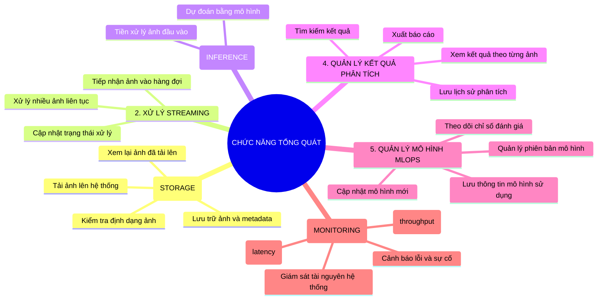
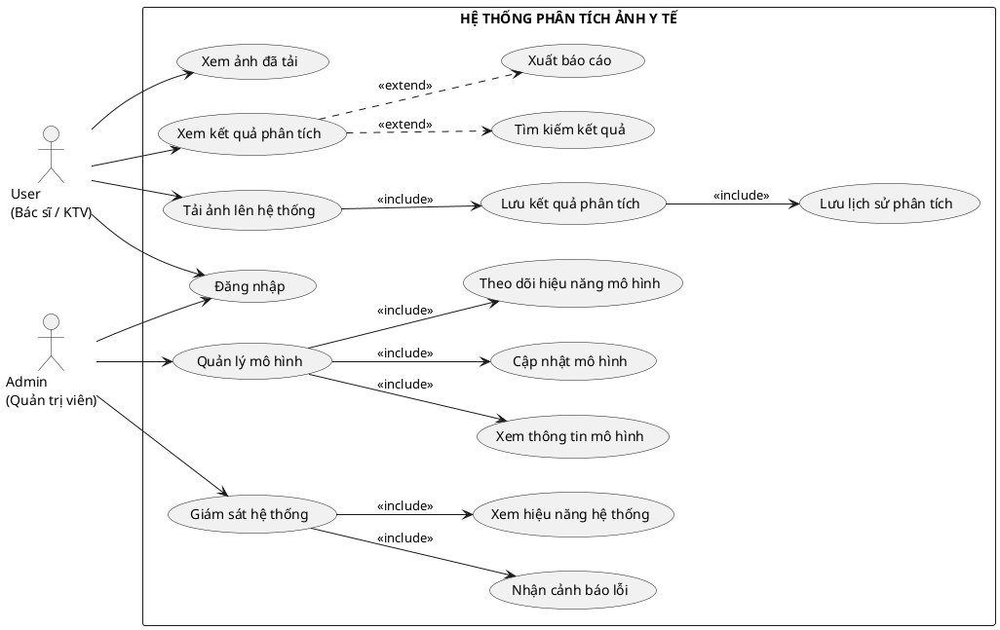
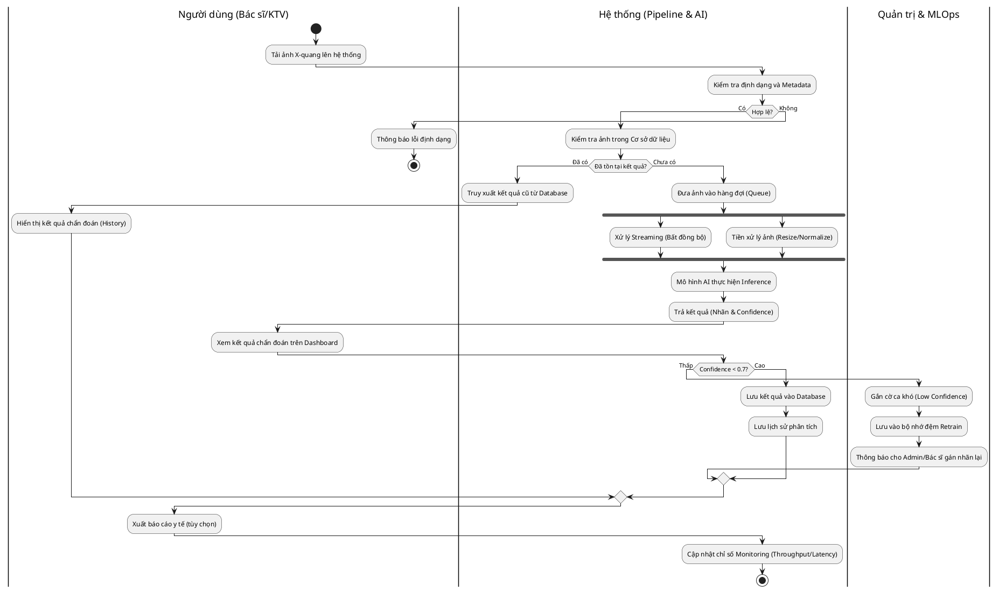
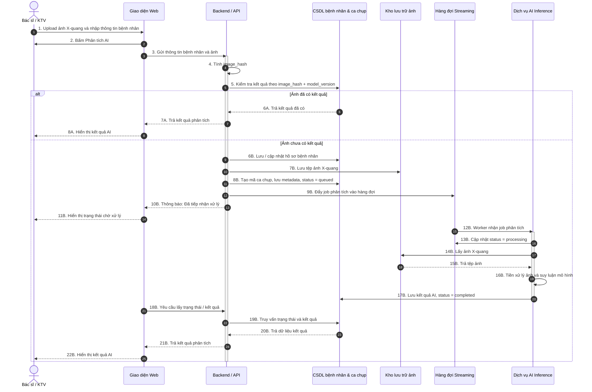
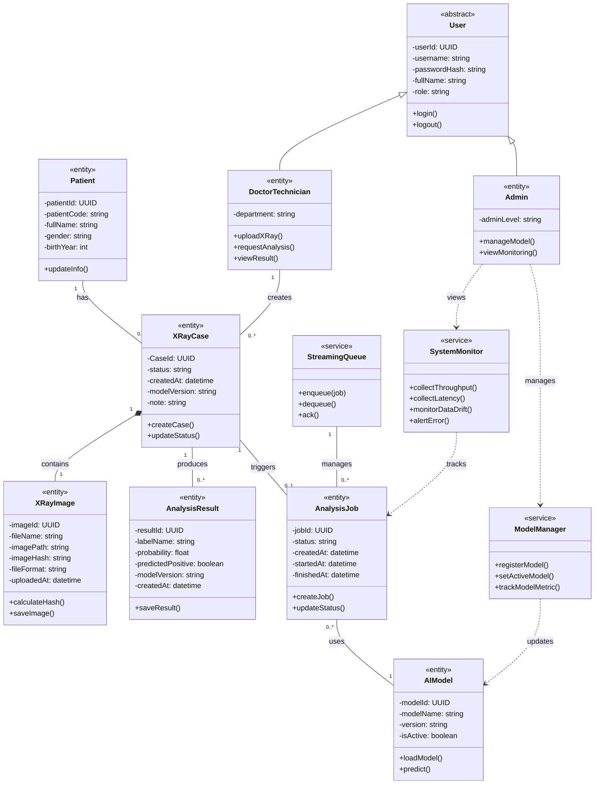
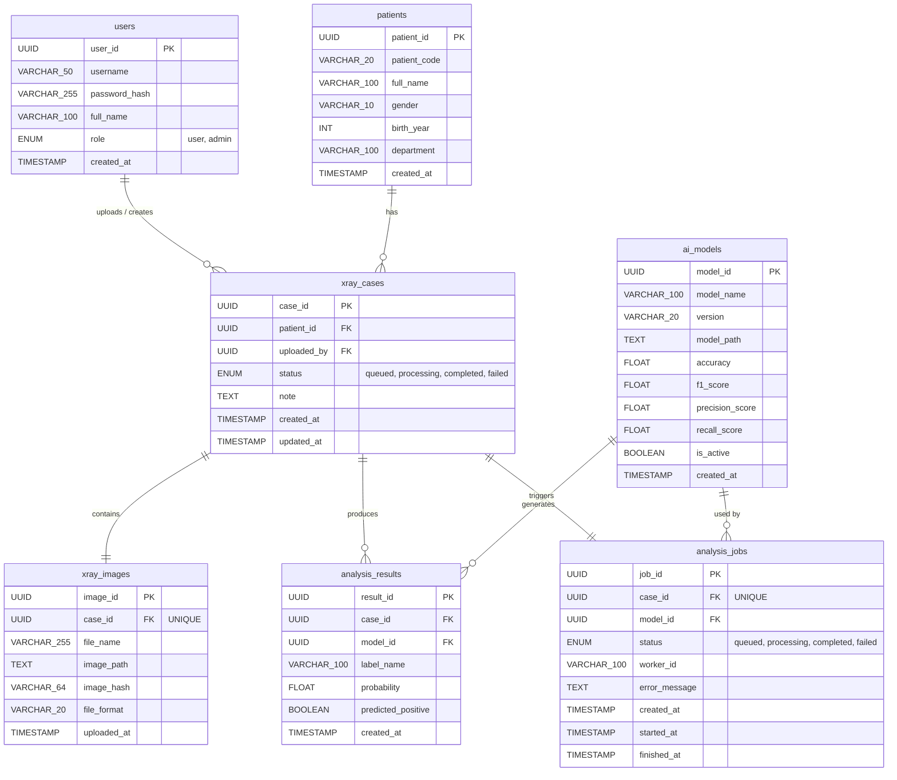

# Tài liệu Thiết kế Hệ thống - Medical Imaging Analysis System

Tài liệu này tổng hợp các sơ đồ thiết kế cho hệ thống phân tích hình ảnh y tế streaming (X-ray/CT).

---

## 1.2 Sơ đồ chức năng tổng quát

---

## 1.3 Usecase Diagram

---

## 1.4 Biểu đồ hoạt động (Activity Diagram)

---

## 1.5 Biểu đồ trình tự (Sequence Diagram)

---

## 1.6 Biểu đồ lớp (Class Diagram)

---

## 1.7 Biểu đồ cơ sở dữ liệu (Database ERD)

---