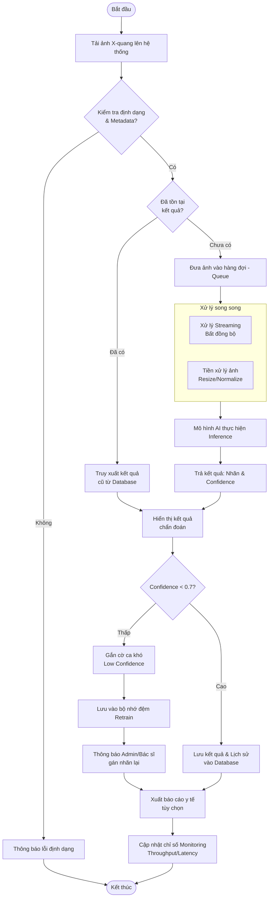

# WORKFLOW.md - Hệ thống Streaming Inference X-Quang Ngực + MLOps Demo

## 1. Mục tiêu của Project

Xây dựng **hệ thống streaming inference hoàn chỉnh** cho phân tích ảnh X-quang ngực hỗ trợ chẩn đoán, tích hợp cơ chế **MLOps đơn giản** (retraining loop).

### Mục tiêu chính:
- Xây dựng pipeline **end-to-end** từ upload ảnh → streaming queue → inference real-time → trả kết quả.
- Hỗ trợ **multi-user** với xử lý bất đồng bộ (asynchronous).
- Triển khai **demo vòng lặp MLOps**: tự động thu thập dữ liệu mới + confidence score → trigger fine-tune khi đủ dữ liệu → versionize và deploy model mới.
- Xây dựng giao diện thân thiện cho **Bác sĩ/KTV** và **Admin**.
- Đảm bảo hệ thống có khả năng giám sát, logging và khả năng mở rộng.

**Phạm vi demo**: 4 lớp (No Finding, Effusion, Infiltration, Atelectasis) sử dụng mô hình pre-trained (ResNet50 / DenseNet121).

---

## 2. Tech Stack

### Frontend
- **ReactJS + Vite + TypeScript** (chính thức)

### Backend
- **FastAPI** (Python 3.11+)
- **SQLAlchemy 2.0** + **Alembic** (migrations)
- **Pydantic v2**

### AI / ML
- **PyTorch + TorchVision**
- **TorchServe** hoặc FastAPI native inference
- **MLflow** (Tracking + Model Registry)

### Queue & Streaming
- **Redis** (broker + cache)
- **Celery** (task queue)

### Database
- **PostgreSQL**

### Object Storage
- **MinIO** (S3 compatible)

### MLOps & Monitoring
- **MLflow**
- **Prometheus + Grafana**

### Container & Orchestration
- **Docker + Docker Compose**
- (Tùy chọn sau: Kubernetes)

### Công cụ khác
- Ruff + Black + isort (code style)
- Pre-commit hooks
- Git + GitHub/GitLab

---

## 3. Cấu trúc dự án

```bash
xray-streaming-mlops/
├── backend/
│   ├── app/
│   │   ├── api/                  # API endpoints
│   │   ├── core/                 # config, database, security
│   │   ├── models/               # SQLAlchemy models
│   │   ├── schemas/              # Pydantic schemas
│   │   ├── crud/                 # CRUD operations
│   │   ├── services/             # Business logic
│   │   ├── tasks/                # Celery tasks (inference, retrain)
│   │   ├── ml/                   # Model loading, inference, preprocessing
│   │   ├── mlops/                # Retraining logic, MLflow
│   │   ├── monitoring/           # Metrics collectors
│   │   └── utils/
│   ├── alembic/                  # Database migrations
│   ├── tests/
│   └── requirements.txt
│
├── frontend/                     # ReactJS
│   ├── src/
│   └── ...
│
├── mlflow/                       # MLflow tracking server
├── minio/                        # Data volume
├── postgres/                     # Database volume
├── redis/                        # Redis volume
│
├── docker-compose.yml
├── Dockerfile.backend
├── Dockerfile.frontend
├── .env.example
├── WORKFLOW.md
├── README.md
└── scripts/                      # Utility scripts
```

---

## 4. Workflow Tổng thể (Luồng hoạt động)



---

## 5. Chi tiết Workflow theo từng bước

### 5.1. Tiếp nhận và Kiểm tra (Validation)
1. User upload ảnh + thông tin bệnh nhân qua API.
2. Hệ thống kiểm tra định dạng file (DICOM/PNG/JPG) và tính `image_hash`.
3. Nếu ảnh đã được phân tích trước đó (trùng hash & model version), hệ thống trả về kết quả cũ ngay lập tức để tiết kiệm tài nguyên.

### 5.2. Pipeline Xử lý và AI Inference
1. Lưu ảnh vào **MinIO** và tạo record trạng thái `queued`.
2. Push task vào **Celery** queue để xử lý bất đồng bộ.
3. **Workflow song song**:
   - Worker cập nhật trạng thái streaming.
   - Đồng thời thực hiện tiền xử lý ảnh (Resize, Normalize).
4. Thực hiện Inference: Load model active từ **MLflow Registry** để dự đoán.
5. Trả kết quả về giao diện cho người dùng.

### 5.3. MLOps / Fine-tune / Evaluation Loop

Trong đề tài này, MLOps được hiểu là quy trình quản lý vòng đời mô hình: theo dõi dữ liệu mới, fine-tune model khi đủ điều kiện, đánh giá model mới và chỉ triển khai model mới nếu đạt yêu cầu. Hệ thống không tự động train lại sau mỗi ảnh mới.

1. **Thu thập dữ liệu mới**:
   - Sau mỗi lần phân tích, hệ thống lưu ảnh, ca chụp và kết quả dự đoán.
   - Các ca có confidence thấp chỉ được đưa vào danh sách cần bác sĩ xem xét/gán nhãn lại. Chỉ những ca đã được bác sĩ xác nhận hoặc gán nhãn lại mới được xem là dữ liệu hợp lệ để fine-tune mô hình.
   - Không sử dụng trực tiếp nhãn dự đoán của AI làm nhãn huấn luyện, vì điều này có thể làm mô hình học lại lỗi sai của chính nó.

2. **Fine-tune model hiện tại**:
   - Khi đủ `N` dữ liệu mới đã xác nhận, hệ thống tạo tập huấn luyện mở rộng bằng cách kết hợp dữ liệu gốc với dữ liệu mới.
   - Model đang active được fine-tune thêm một số epoch thay vì train lại từ đầu để tiết kiệm tài nguyên và phù hợp phạm vi demo.

3. **Evaluation model mới**:
   - Sau fine-tune, model mới phải được đánh giá trên tập validation/test cố định.
   - Các metric cần tính gồm: `accuracy`, `f1_score`, `precision_score`, `recall_score`.
   - Các metric này được log bằng MLflow và lưu vào bảng `ai_models`.

4. **So sánh và triển khai model**:
   - Model mới chỉ được set `is_active = true` nếu metric tốt hơn hoặc đạt ngưỡng chấp nhận so với model đang active.
   - Nếu model mới không đạt yêu cầu, hệ thống giữ nguyên model cũ.
   - Tại một thời điểm chỉ có một model active để phục vụ inference.

### 5.4. Giám sát và Báo cáo (Monitoring)
1. Hệ thống ghi lại các chỉ số:
   - **Throughput**: Số lượng ảnh xử lý trên mỗi đơn vị thời gian.
   - **Latency**: Thời gian phản hồi từ lúc upload đến khi có kết quả.
2. Người dùng có thể xuất báo cáo y tế định dạng PDF dựa trên kết quả AI.

---

## 6. Thứ tự triển khai code (Recommended Development Order)

### Phase 0: Setup cơ sở hạ tầng
1. Tạo `docker-compose.yml` (PostgreSQL, Redis, MinIO, MLflow)
2. Config `.env` và volumes

### Phase 1: Backend Core
1. FastAPI project + health check
2. Database models + Alembic migrations (theo ER Diagram)
3. MinIO client service
4. Authentication (JWT) + Role (User/Admin)

### Phase 2: ML Core
1. Model loader + inference function
2. Preprocessing pipeline
3. Test inference với model pre-trained

### Phase 3: Streaming Pipeline
1. Celery configuration + Redis broker
2. Tạo Celery task `perform_inference`
3. Integration: Upload → Queue → Worker → Result

### Phase 4: API & Business Logic
1. CRUD cho Patient, Case, Image, Result
2. Endpoints cho upload, get result, history, search
3. Admin APIs: model management

### Phase 5: MLOps
1. MLflow tracking + registry integration
2. Retraining service + buffer logic
3. Scheduler (Celery Beat) hoặc manual trigger retrain

### Phase 6: Frontend
1. ReactJS UI (hoặc Streamlit trước)
2. Upload component + progress tracking (polling hoặc WebSocket)
3. Dashboard, Result viewer, Admin panel

### Phase 7: Monitoring & Polish
1. Prometheus + Grafana
2. Logging (structlog)
3. Error handling & retry mechanism
4. Testing & Documentation

---

## 7. Lưu ý quan trọng khi code

### Coding Style & Quy ước
- **Python**: Black + Ruff + isort
- **Type Hint** nghiêm ngặt
- Tên class: `PascalCase`
- Tên function/variable: `snake_case`
- Constants: `UPPER_CASE`

### Best Practices
- Mọi business logic phức tạp phải nằm trong `services/` hoặc `tasks/`
- Không để logic ML trực tiếp trong API route
- Sử dụng dependency injection của FastAPI
- Luôn validate input bằng Pydantic
- Xử lý lỗi tập trung (custom exception + HTTPException)
- Logging đầy đủ ở mức INFO/ERROR
- Async khi có thể (FastAPI + Celery)

### Quan trọng kỹ thuật
- Model phải được load **một lần** và giữ trong memory (singleton pattern hoặc TorchServe).
- Sử dụng `image_hash` để tránh xử lý trùng lặp.
- Celery worker nên chạy nhiều instance nếu có GPU.
- Luôn lưu `model_version` cùng với kết quả inference.
- Buffer retraining nên có cơ chế TTL hoặc xóa sau khi retrain thành công.
- Test inference trên CPU và GPU riêng biệt.

### Security & Production
- Không expose MinIO public
- Rate limiting cho API upload
- Validate file type và size
- Sanitize metadata bệnh nhân

**Mục tiêu cuối cùng**: Hệ thống phải chạy mượt mà chỉ với lệnh `docker-compose up --build`.

---